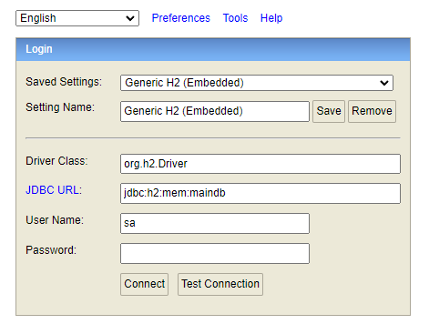

# Transaction Manager Test App by Omar Fernando Moreno Benito
## Introduction
This project is the base to build others similar to this and test functionality about transactions
## Installation and Run
It is needed to have installed maven and java 19 for this project to run.

To start the microservice with local configuration you have to execute the following:
`mvn spring-boot:run`

To check the data in database we can browse h2 console:

http://localhost:8080/h2-console without password as it is showed bellow

Once started, we can take a look to the service API through Swagger:

http://localhost:8080/swagger-ui/index.html

## Run Tests
If you have to execute the tests in the project, you have to execute the following: 
`mvn test`